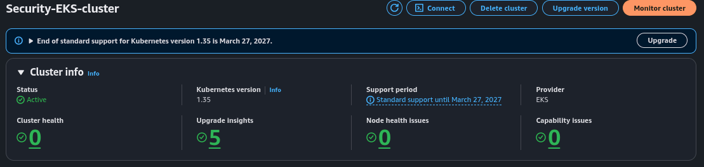
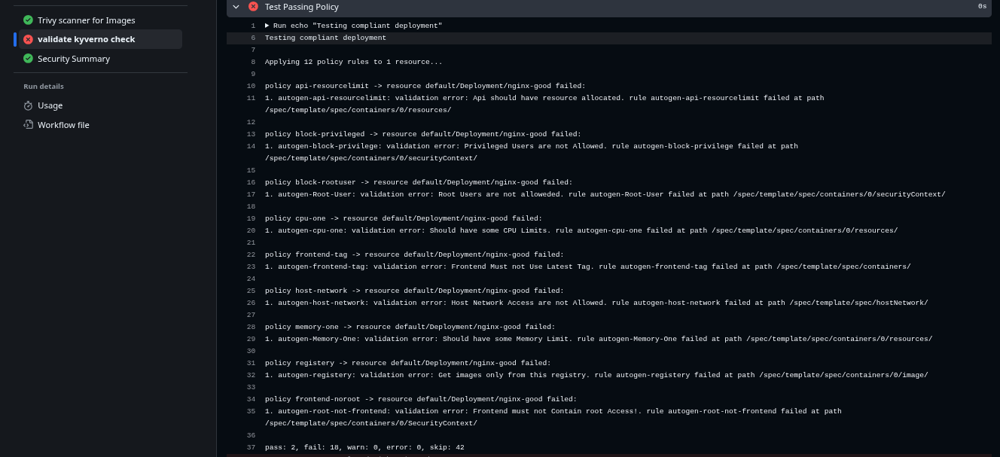
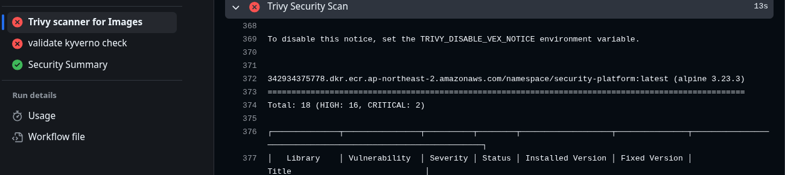
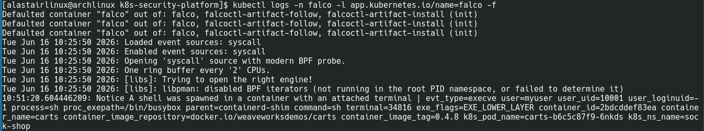

# 🛡️ Kubernetes Security Platform

A cloud-native DevSecOps platform that automates container security scanning, Kubernetes policy validation, runtime security monitoring, and cloud security visibility using AWS, Kubernetes, GitHub Actions, Trivy, Kyverno, Falco, Prometheus, and Security Hub.

---

##  Project Overview

This project demonstrates a complete DevSecOps workflow by integrating:

* CI/CD Security Automation
* Container Vulnerability Scanning
* Kubernetes Policy Enforcement
* Runtime Threat Detection
* Security Monitoring & Alerting
* Cloud Security Visibility

The platform follows a Shift-Left Security approach by validating workloads before deployment and monitoring them after deployment.

---

#  Architecture

```text
Developer
    │
    ▼
GitHub Repository
    │
    ▼
GitHub Actions CI/CD
    │
    ├── Trivy Image Scanning
    │
    ├── Kyverno Policy Validation
    │
    └── Deploy to Amazon EKS
                 │
                 ▼
          Amazon EKS Cluster
                 │
                 ├── Falco Runtime Security
                 │
                 ├── Prometheus Monitoring
                 │
                 └── Security Event Collection
                               │
                               ▼
                       AWS Security Hub
```

---

#  Technologies Used

## Cloud

* AWS EKS
* AWS ECR
* AWS Security Hub

## Containerization

* Docker

## Kubernetes Security

* Kyverno
* Falco

## Monitoring

* Prometheus

## Security Scanning

* Trivy

## CI/CD

* GitHub Actions

## Reporting

* SARIF Reports

---

#  Security Controls Implemented

## Trivy Vulnerability Scanning

Automated image scanning for:

* Critical Vulnerabilities
* High Vulnerabilities
* OS Package Vulnerabilities
* Secret Detection

Features:

* ECR Image Scanning
* SARIF Report Generation
* GitHub Security Integration

---

## Kyverno Policy Enforcement

Implemented Kubernetes security policies:

### Resource Governance

* CPU Limits Required
* Memory Limits Required
* Resource Requests Required

### Container Security

* Block Privileged Containers
* Block Root Users
* Enforce Security Context

### Image Security

* Restrict Image Registry
* Block Latest Tags

### Network Security

* Restrict Host Network Access

---

## Falco Runtime Security

Runtime threat detection for Kubernetes workloads.

Monitors:

* Shell Execution Inside Containers
* Privilege Escalation
* Suspicious Process Execution
* Unauthorized File Access
* Container Escape Attempts
* Kubernetes Security Events

---

## AWS Security Hub

Centralized security findings aggregation.

Provides:

* Severity Classification
* Security Findings Dashboard
* Compliance Visibility
* Threat Prioritization

---

## Prometheus Monitoring

Cluster observability and monitoring.

Monitors:

* Node Metrics
* Pod Metrics
* Cluster Health
* Resource Utilization
* Kubernetes Workloads

---

# 📸 Screenshots

## Amazon EKS Cluster Running



---

## AWS Security Hub Findings


---

## Prometheus Monitoring Dashboard


---

## Kyverno Policy Validation in GitHub Actions



---

## Trivy Vulnerability Detection in GitHub Actions



---

## Falco Runtime Threat Detection


Demonstrates runtime security monitoring by detecting shell execution inside a running Kubernetes container.

Example detection:

Terminal access inside container
Suspicious process execution
Runtime threat visibility

---

# ⚙️ GitHub Actions Pipeline

The CI/CD pipeline performs:

### Step 1

Authenticate with AWS

### Step 2

Login to Amazon ECR

### Step 3

Pull Container Image

### Step 4

Run Trivy Vulnerability Scan

### Step 5

Generate SARIF Security Report

### Step 6

Upload Security Findings

### Step 7

Validate Kubernetes Policies using Kyverno

---

#  Key Achievements

* Automated container image security scanning
* Implemented Kubernetes policy-as-code
* Integrated cloud-native runtime security monitoring
* Enabled centralized security visibility
* Built a DevSecOps CI/CD workflow
* Automated security validation before deployment
* Monitored runtime threats after deployment

---

# 📈 Future Enhancements

* Grafana Dashboards
* Gitleaks Secret Scanning
* Semgrep SAST Integration
* OWASP Dependency Check
* Slack Security Alerts
* Automated Remediation Workflows

---

#  Author

Afsan Ahmed

DevSecOps | Cloud Security | Kubernetes Security | AWS

