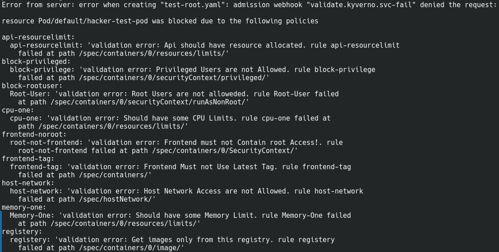
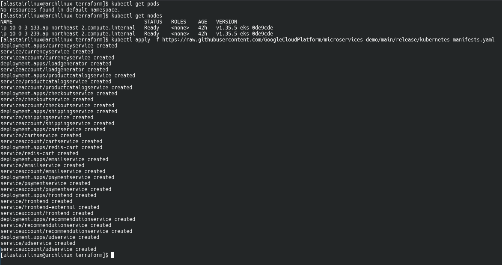
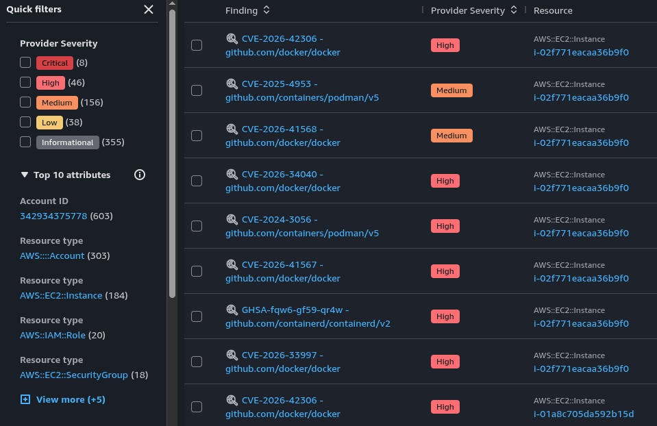
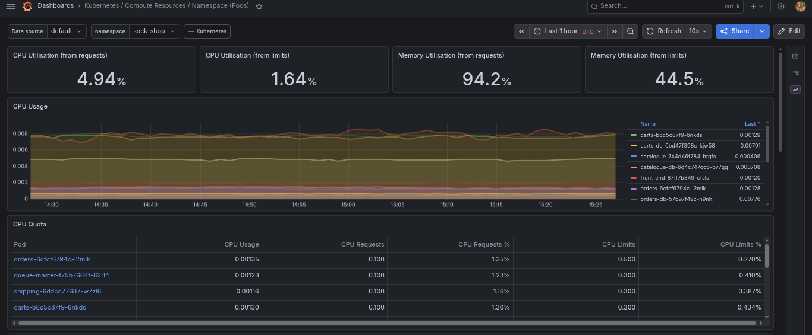
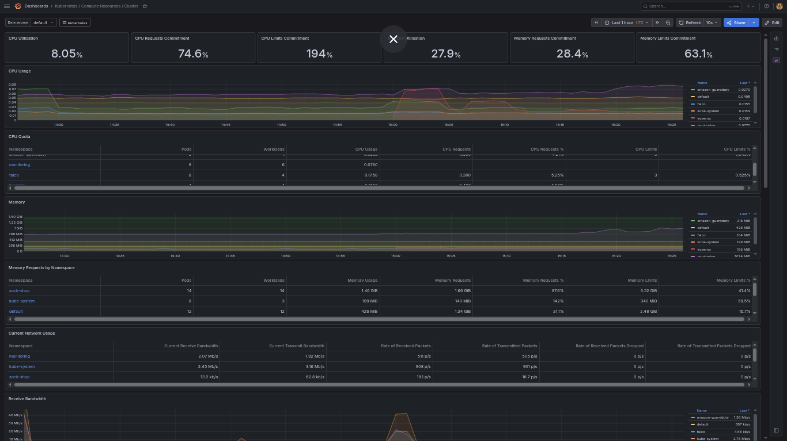

# Kubernetes Security Operations Platform

A production-grade security platform built on AWS EKS, integrating runtime threat detection, policy enforcement, and automated incident response — designed to detect and prevent real-world container attack patterns.

## Architecture

Developer pushes image
↓
Kyverno enforces policies at deployment (10 custom policies)
↓
Application runs on EKS (Sock Shop microservices)
↓
Falco detects runtime threats (shell spawns, privilege escalation, file access)
↓
Falco Sidekick routes alerts → AWS SNS
↓
SNS triggers Lambda
↓
Lambda pushes findings to AWS Security Hub
↓
Prometheus + Grafana monitor cluster health

## Tech Stack

- **Infrastructure**: Terraform, AWS EKS, VPC, NAT Gateway, IAM
- **Policy Enforcement**: Kyverno (10 custom admission control policies)
- **Runtime Security**: Falco (syscall-level threat detection)
- **Monitoring**: Prometheus, Grafana
- **Incident Response**: AWS Lambda, SNS, Security Hub
- **Application**: Sock Shop microservices demo (frontend, orders, carts, users, MongoDB, MySQL)

## Infrastructure (Terraform)

All infrastructure is provisioned as code:
- Custom VPC with public/private subnet architecture
- NAT Gateway for private subnet internet access
- EKS cluster with managed node groups
- IAM roles following least privilege principle

## Policy Enforcement (Kyverno)

10 custom policies enforce security best practices at admission time, including blocking root users, blocking privileged containers, requiring resource limits, blocking `latest` image tags, enforcing trusted registry sources, and namespace isolation for sensitive services like databases.

### Policy Enforcement in Action

Below, a pod attempting to run as root is blocked at admission:

## Runtime Threat Detection (Falco)

Falco monitors syscalls at the kernel level to detect suspicious activity in real time. In a simulated attack scenario, a shell was spawned inside the `carts` service container — detected instantly:

## Automated Incident Response

Falco alerts are routed through Falco Sidekick to AWS SNS, which triggers a Lambda function that transforms and pushes findings into AWS Security Hub for centralized visibility.

## Monitoring (Prometheus + Grafana)

Cluster health and resource usage are monitored via Prometheus, visualized in Grafana dashboards.

## Project Structure

k8s-security-platform/

├── terraform/              # Infrastructure as Code (VPC, EKS, IAM)

├── kubernetes/

│   └── policies/            # 10 Kyverno ClusterPolicy definitions

├── lambda/                  # Lambda function: Falco alerts → Security Hub

└── docs/screenshots/        # Project evidence

## Key Results

- 10 Kyverno policies actively enforcing pod security standards across the cluster
- Real-time runtime detection of shell access, privilege escalation attempts, and sensitive file reads
- Fully automated alert pipeline from detection to centralized findings (Falco → SNS → Lambda → Security Hub)
- Infrastructure fully reproducible via Terraform

## Future Improvements

- Integrate Trivy into CI/CD pipeline for pre-deployment image scanning
- Add automated remediation (Lambda auto-quarantine of compromised pods)
- Expand Kyverno policy set to cover network policies and pod security admission
